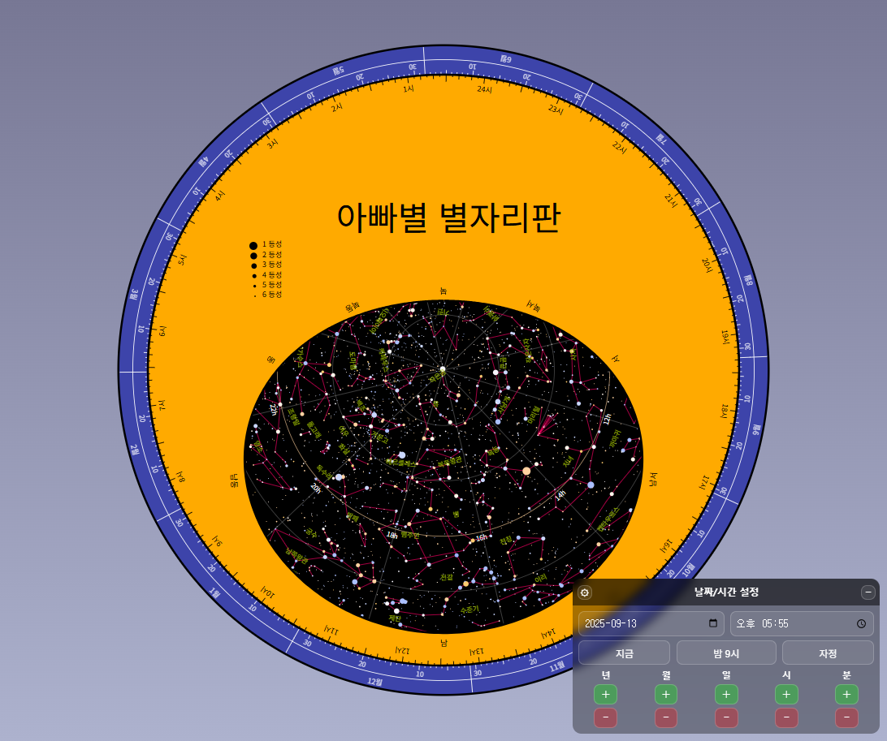

# 아빠별 별자리판



이 **별자리판(플라니스피어)** 은 웹브라우저에서 바로 실행되는 프로그램입니다.

누구나 시간과 장소에 따라 보이는 하늘을 쉽게 확인할 수 있도록 만든 도구로, **과학 선생님과 학생들이 우주와 천문학에 조금 더 흥미를 가지길 바라는 마음**에서 제작했습니다.  

- 상업적 목적이 아니라면 개인이나 단체에서 자유롭게, 무료로 활용할 수 있습니다.  
  - [라이선스 확인하기](LICENSE.md)

- 사용하기 : [아빠별 별자리판](https://jidolstar.github.io/planisphere-js/)  
    - 회전 : 마우스 왼쪽 버튼 누르고 드래그
    - 확대/축소 : 마우스 휠 
    - 이동 : 마우스 오른쪽 버튼 드래그 또는 Ctrl + 마우스 왼쪽 버튼 누르고 드래그 
    - 날짜/시간 조정 : 특정 날짜와 시간, 자정, 밤 9시 설정 가능 
    - 테마 : 기본 테마외에 다크, 라이트 지원

- 코드는 HTML/CSS/Javascript로 작성되었으며 Github를 통해 완벽하게 오픈되어 있으므로 언제든 구현부를 참고할 수 있습니다.

참고로 이 프로젝트는 예전에 천문노트(astronote.org, 현재는 닫힘)에서 제공하던 Flash 버전을, 요즘 웹 환경에서 동작하도록 새롭게 구현한 것입니다.  

추가 문의는 제작자 **지용호(jidolstar@지메일)** 로 연락 주시면 됩니다.  


## 버전
- 1.0.2 : 지금/밤9시/자정 버튼 버그 fix 
  - [issue/1](https://github.com/jidolstar/planisphere-js/issues/1)
  - 버튼을 누르고 별자리판을 회전시킨 다음 다시 같은 버튼을 누르면 반응이 없음. 이는 계산된 LST하고 같으면 무시해서 발생된 문제임. 같더라도 무시하지 않게 바꿈. 
- 1.0.1 : 최초 버전
  - 적경,적위,6등성까지 주요 별, 별자리선 렌더링 
  - 진정오를 기반으로 적경과 날짜를 일치
  - 지역 경도와 지방시를 기준으로 시간환 생성. 한국의 경우 동경 135도 기준으로 시간을 쓰기 때문에 30분 차이가 나는 것도 반영됨. 
  - 이동,회전,확대/축소 기능 지원
  - 날짜/시간으로 선택 지원 
  - 3종류 테마(기본/다크/라이트) 선택 지원


---

## 주요 코드와 구조 설명

별자리판은 단순한 그림이 아니라, 실제 **천문학적 계산**을 기반으로 동작합니다. 아래는 이 프로젝트의 주요 파일과 역할을 정리한 것입니다.  


## index.html (메인 페이지)
별자리판 웹앱의 메인 페이지로, 다음과 같은 구조와 역할을 가집니다.

SVG.js와 각종 데이터/로직 JS 파일을 불러와서, `#planisphere` 컨테이너에 별자리판을 동적으로 생성한다. 모바일/PC 모두 대응하며, SEO와 SNS 공유도 고려되어 있습니다.

**1. 기본 정보 및 메타 태그**

- 한글(lang="ko")로 작성.
- SEO 및 SNS 공유를 위한 다양한 메타 태그(설명, 키워드, og:image 등) 포함.
- 모바일 대응을 위한 viewport 설정.

**2. 스타일**
- html, body는 margin/padding 제거, 스크롤 숨김.
- SVG 텍스트는 드래그/선택 불가 처리.

**3. 스크립트 로딩**
- SVG.js 라이브러리(svg.min.js) CDN으로 불러옴.
- 프로젝트의 주요 JS 파일들 순서대로 로딩:
    - astro.js: 천문 계산 관련
    - conline.js: 별자리선 데이터
    - conname.js: 별자리 이름 데이터
    - stars.js: 별 데이터
    - planisphere.js: 별자리판 렌더링 및 상호작용

**4. 본문 구조**
- `<div id="planisphere" style="width:100%"></div>`: 별자리판이 그려질 SVG 컨테이너.
- 마지막 `<script>`에서 `new Planisphere('#planisphere')`로 별자리판 인스턴스 생성 및 렌더링 시작.


### astro.js (천문 계산 핵심)

별자리판을 그릴 때 필요한 천문학적 시간/좌표 변환, 3D 벡터/행렬 연산, 그리고 2D 투영까지 모든 수학적 기반을 제공합니다.

별의 위치를 계산하고, 화면에 올바르게 표시하기 위한 핵심 로직이 모두 담겨 있습니다.

- AstroMath (상수 및 유틸리티)
    - 라디안/도/시간 변환
    - Julian Day, PI 등 천문 계산에 필요한 상수와 mod, normalize 같은 유틸리티 함수 제공.

- AstroTime (시간/좌표 변환)
    - Julian Day 계산, UT/GST/LST 등 천문 시간 변환 함수 제공.
    - 위도/경도/시간대 정보를 받아 다양한 천문 시간 변환을 수행.
- AstroVector (3D 벡터)
    - 천구상의 위치를 3D 벡터로 표현.
    - 구면좌표 ↔ 벡터 변환, 좌표계 변환    (적도↔황도↔은하↔지평) 함수 제공.
- AstroPoint (2D 점)
    - 2D 평면상의 점 표현.
- AstroMatrix (3x3 행렬)
    - 좌표계 변환에 사용되는 행렬 연산.
    - 각종 좌표계 변환(적도↔지평, 황도↔적도 등)용 행렬 생성 및 곱셈 지원.

- EquiDistanceProjection (등거리 투영)
    - 별의 적경/적위를 화면상의 x, y로 투영.
    - 화면 반경과 적위 한계값을 기반으로 천구의 가상 반경 계산.
    - 북위 90도가 (0,0)에 위치하도록 투영.

### conline.js (별자리 선 데이터)

별자리판에서 윤곽선을 그릴 때 사용하는 선분 데이터(적경/적위 좌표 쌍)를 담고 있습니다. 

별자리의 선(별자리선을 연결하는 선분)을 정의하는 숫자 배열이다. 4개씩 묶어서 하나의 선을 나타냅니다.

[RA1, DEC1, RA2, DEC2]

- RA1: 시작점의 적경(라디안)
- DEC1: 시작점의 적위(라디안)
- RA2: 끝점의 적경(라디안)
- DEC2: 끝점의 적위(라디안)

예시:
→ (적경 0.427..., 적위 0.848...)에서 (적경 0.303..., 적위 0.824...)까지 선을 그림
단위

### conname.js (별자리 이름 데이터)

별자리판에서 각 별자리에 이름을 표시하는 데 사용됩니다.

[적경, 적위, 별자리명] 형태로 데이터를 담고 있습니다. 

- 적경(RA): 별자리의 중심 또는 대표 위치의 적경(라디안)
- 적위(DEC): 별자리의 중심 또는 대표 위치의 적위(라디안)
- 별자리명: 별자리의 한글 이름
- 예시: (적경 0.185..., 적위 0.688...) 위치에 "안드로메다"라는 이름을 표시
```
0.185877565,0.68853239,"안드로메다",
2.649409805,-0.585732497,"공기펌프",
```

### star.js (별 데이터)


별자리 판에서 별을 표시하는 데 사용됩니다.

각 별은 CSV(쉼표로 구분된 값) 형식의 문자열로 별 데이터를 저장되어 있습니다.

각 행의 데이터 구조

```
이름,별칭,적경(RA),적위(Dec),등급(mag),분광형(type)
```

- 이름: 별의 고유 이름 또는 식별자 (없으면 빈 값)
- 별칭: 별의 별명 또는 추가 이름 (없으면 빈 값)
- 적경(RA): 별의 적경(시간 단위, 소수점)
- 적위(Dec): 별의 적위(도 단위, 소수점)
- 등급(mag): 밝기(등급, 숫자)
- 분광형(type): 별의 분광형(예: O, B, A, F, G, K, M)

예시
```
Tau Phe,,0.01794397,-48.80985919,5,G
,,0.02225348,-50.33739907,5,M
The Oct,,0.02662528,-77.06529438,4,K
```

- 첫 번째 별: 이름은 "Tau Phe", 별칭 없음, RA=0.01794397, Dec=-48.80985919, 등급=5, 분광형=G
- 두 번째 별: 이름/별칭 없음, RA=0.02225348, Dec=-50.33739907, 등급=5, 분광형=M

각 줄을 분리해서 별의 위치, 밝기, 색상 등을 계산해 별자리판에 표시합니다.

### planisphere.js (별자리판 핵심 렌더링 로직)

SVG를 이용해 별자리판(플라니스피어)을 그리는 주요 렌더링 로직을 담고 있습니다.

**1. Planisphere 클래스**

핵심 클래스인 Planisphere를 정의하고 있습니다.

생성자에서 SVG 패널(배경, 하늘, 상단, 정보)을 생성하고, 스타일/좌표/시간 관련 속성을 초기화합니다.

마우스/터치 이벤트를 바인딩해 별자리판을 회전할 수 있게 합니다.

**2. Planisphere 클래스 내 렌더링 메서드**

- render()
    - 전체 렌더링을 담당하며, 하늘/상단/정보 패널을 각각 그립니다.

- renderSkyPanel()
    - 날짜 눈금: 월/일 경계선, 월/일 텍스트를 원형으로 배치.
    - 적경/적위선: 천구 좌표계의 선을 그림.
    - 별자리선: dataConLineList를 이용해 별자리 연결선 그림.
    - 별
        - starList의 CSV 데이터를 파싱해 각 별의 위치, 밝기, 색상(분광형에 따라)을 결정.
        - 화면 반경 내에 있는 별만 SVG 원(circle)으로 그림.
    - 별자리 이름: dataConNameList의 좌표에 이름을 배치.

- renderTopPanel()
    - 지평좌표계 커버: 현재 시간 기준으로 보이는 하늘 영역을 그림.
    - 동서남북 방향: 각 방향의 이름을 배치.
    - 시간 눈금: 24시간/분 단위로 원형 눈금을 그림.

- renderInfoPanel()
    - 범례: 등급별 별 크기와 텍스트 설명.
    - 타이틀: 별자리판 이름 표시.


**3. 좌표 변환 및 시간 계산**

- 적경/적위 → 화면 좌표: EquiDistanceProjection 클래스의 project() 메서드 사용.
- 지평좌표계 → 적도좌표계: 행렬 변환(AstroMatrix)을 통해 현재 시간/위도에 맞게 변환.
- 시간 계산: AstroTime 클래스 활용. 월/일/시간별로 천구상의 위치를 계산.

**4. 별 데이터 처리**

- starList는 CSV 문자열로 별 정보를 저장.
- 각 별의 밝기(등급)에 따라 크기/투명도, 분광형에 따라 색상 결정.
- 화면 반경 내에 있는 별만 그림.

**5. 상호작용**
- 마우스/터치 드래그로 별자리판을 회전 가능.
- 현재 날짜/시간에 따라 별자리판이 자동으로 회전(rotateCurrentDate()).

**6. 기타**
- 스타일, 색상, 폰트 등은 클래스 속성으로 관리.
- SVG.js 라이브러리를 사용해 SVG 요소를 동적으로 생성/조작. 
